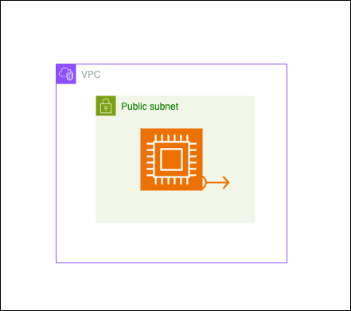

# AWS VPC and EC2 Configuration with Terraform Workspaces

This hands-on demonstrates the use of Terraform to create AWS infrastructure using workspaces and a local backend. It showcases how to manage multiple environments (UAT, staging, prod) with a single Terraform configuration.

## Key Configuration Points

Create a Terraform configuration with the following specifications:

- Use a local backend with three workspaces (UAT, staging, prod)
- One config folder (root module) for three workspaces
- Deploy the below architecture with respective value files (e.g., uat.tfvars) in respective workspaces

- Avoid using the default workspace
- Use input variables for vpc_cidr and public_subnet_cidr
- Uses existing key pair for EC2 instance
- Set resource names based on the current Terraform workspace
  - VPC name → $(terraform.workspace)-vpc
  - Key Pair name → $(terraform.workspace)-public-key
  - EC2 instance name → $(terraform.workspace)-instance
- Include specific tags for EC2 instances
  - EC2 tags include "Managed by": "Terraform" (referenced from locals)

## Code Layout

```
.
├── main.tf         # Main Terraform configuration file
├── variables.tf    # Input variable declarations
├── outputs.tf      # Output value declarations
├── locals.tf       # Local value definitions
├── uat.tfvars      # UAT environment-specific variables
├── staging.tfvars  # Staging environment-specific variables
└── prod.tfvars     # Production environment-specific variables
```

## Learning Outcomes

- Implementing multi-environment setups using Terraform workspaces
- Managing environment-specific configurations with variable files
- Applying dynamic resource naming in Terraform
- Configuring basic AWS networking components (VPC, subnet) with Terraform
- Deploying and managing EC2 instances and Elastic IPs with Terraform